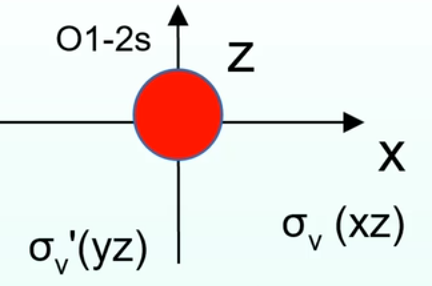
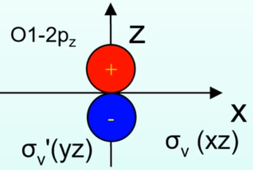
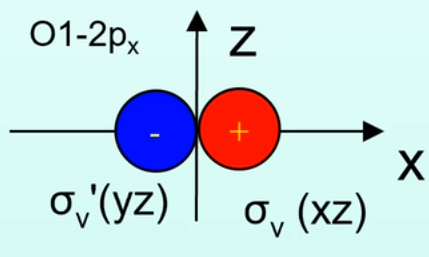
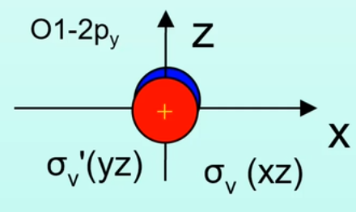
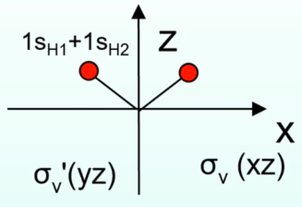
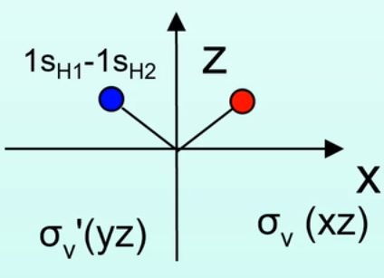

# 1.[群的表示](https://www.bilibili.com/video/BV1aX4y1P7kw/?spm_id_from=333.1007.top_right_bar_window_history.content.click&vd_source=3d493d380784c06576a07f04c8c83ec2)
_矩阵为操作，原子轨道和分子轨道都可以作为操作对象（基）_
## 1.1什么是表示
群里的每一个元素都代表一个操作，根据不同的操作对象（也就是基），群可以用不同的举证了矩阵来表示。以$C_{2v}$群为例。该其其中的元素有『$\hat{E}$,$\hat{C_2}$,$\hat{\sigma_v}$,$\hat{\sigma_v}^{'}$』。以水分子的三个原子为基函数为例：
$$\hat{\sigma}_v^{'}\left(\begin{matrix}
   O_1 \\
   H_2 \\
   H_3 
  \end{matrix}
  \right) = 
 \left(\begin{matrix}
   O_1 \\
   H_3 \\
   H_2 
  \end{matrix}
  \right)  $$
则$\hat{\sigma_v}^{'}$可以用矩阵表示为
$$\hat{\sigma}_v^{'}= 
 \left(\begin{matrix}
   1&0&0 \\
   0&0&1 \\
   0&1&0 
  \end{matrix}
  \right)  $$
同理，其他三个操作也有对应着一个矩阵表示：
$$\hat{\sigma}_v=\left(\begin{matrix}
   1&0&0 \\
   0&1&0 \\
   0&0&1 
  \end{matrix}
  \right) ,\hat{E}=
 \left(\begin{matrix}
   1&0&0 \\
   0&1&0 \\
   0&0&1
  \end{matrix}
  \right) , \hat{C_2}=\left(\begin{matrix}
   1&0&0 \\
   0&0&1 \\
   0&1&0
  \end{matrix}
  \right)   $$
对于这个基函数，这个群的矩阵表示如上所示，它们两两之间也符合$C_{2v}$群的[乘法表](https://zh.webqc.org/symmetrypointgroup-c2v.html)
又可以把这种情况下$C_{2v}$群的矩阵表示写成如下形式：
|  | $E$ | $C_2$ | $\sigma_v$ |$\sigma_v^{'}$|
| :---- | ----: | :----: | ---- |----|
|$\Gamma$|3|1|3|1|

__*其中每个元素下的数字是该元素对应的矩阵的迹。而E的值代表该种表示的阶数。*__

## 1.2群表示是唯一的吗
现在将空间内一个点（x，y，z）作为基函数，那么这四个操作的对应矩阵为：
$$\hat{\sigma}_v=\left(\begin{matrix}
   1&0&0 \\
   0&-1&0 \\
   0&0&1 
  \end{matrix}
  \right) ,
  \hat{\sigma}_v^{'}=\left(\begin{matrix}
   -1&0&0 \\
   0&1&0 \\
   0&0&1 
  \end{matrix}
  \right) ,\hat{E}=
 \left(\begin{matrix}
   1&0&0 \\
   0&1&0 \\
   0&0&1
  \end{matrix}
  \right) , \hat{C_2}=\left(\begin{matrix}
   -1&0&0 \\
   0&-1&0 \\
   0&0&1
  \end{matrix}
  \right)   $$
又可以把这种情况下$C_{2v}$群的矩阵表示写成如下形式：
|  | $E$ | $C_2$ | $\sigma_v$ |$\sigma_v^{'}$|
| :---- | ----: | :----: | ---- |----|
|$\Gamma$|3|-1|1|1|

__*选择不同的基函数，会得到同样一个群的不同矩阵表示，这也就是为什么群的表示有无数种，但是不可约表示却是唯一的（不同的矩阵表示可以化简到同一个可不可约表示）*__

## 1.3可约表示与不可约表示
对于$\hat{\sigma}_v=\left(\begin{matrix}
   1&0&0 \\
   0&-1&0 \\
   0&0&1 
  \end{matrix}
  \right) ,
  \hat{\sigma}_v^{'}=\left(\begin{matrix}
   -1&0&0 \\
   0&1&0 \\
   0&0&1 
  \end{matrix}
  \right) ,\hat{E}=
 \left(\begin{matrix}
   1&0&0 \\
   0&1&0 \\
   0&0&1
  \end{matrix}
  \right) , \hat{C_2}=\left(\begin{matrix}
   -1&0&0 \\
   0&-1&0 \\
   0&0&1
  \end{matrix}
  \right)   $
这都是对角阵，它们的$a_{11}$的位置是在变换x；$a_{22}$的位置是在变换y；$a_{33}$的位置是在变换z。因此，这个三维的矩阵可以分解为三个一维矩阵表示：
|  | $E$ | $C_2$ | $\sigma_v$ |$\sigma_v^{'}$|
| :---- | ----: | :----: | ---- |----|
|$\Gamma_1$|1|-1|1|-1|
|$\Gamma_2$|1|-1|-1|1|
|$\Gamma_3$|1|1|1|1|

即，例子中的三维矩阵是可以分解的，称为可约表示，分解后的三个一维矩阵都不能再分解，称为不可约表示

__*对于一个特定的群，可约表示的数目是无限的，但是不可约表示的数目是一定的。而一个群的所有不可约表示的维数的平方和等于群的阶数*__

$C_{2v}$群的阶数为4,它的所有不可约表示为(查表获得)：
|  | $E$ | $C_2$ | $\sigma_v$ |$\sigma_v^{'}$|
| :---- | ----: | :----: | ---- |----|
|$\Gamma_1$|1|-1|1|-1|
|$\Gamma_2$|1|-1|-1|1|
|$\Gamma_3$|1|1|1|1|
|$\Gamma_4$|1|1|-1|-1|

## 1.4群的表示与分子轨道，原子轨道

以O的2$s$轨道为例，其在四个对称操作下的变换矩阵为：（1）（1）（1）（1），所以该轨道属于$\Gamma_3$这个不可约表示；

对于O的2$p_z$轨道，其变换矩阵为：（1）（1）（1）（1），也属于$\Gamma_3$这个不可约表示；

对于O的2$p_x$轨道，其变换矩阵为：（1）（-1）（1）（-1），属于$\Gamma_1$这个不可约表示；

对于O的2$p_y$轨道，其变换矩阵为：（1）（-1）（-1）（1），属于$\Gamma_2$这个不可约表示；
所以一个不可约表示可以对应在不止一个轨道.

对于氢原子，无法将单独一个氢原子的1$s$轨道作为变换基（会出现可约表示，需要化简），所以可以将两个氢原子的1$s$轨道线性组合为变换的基：

对于1$s_{H_1}$+1$s_{H_2}$，其变换矩阵为：（1）（1）（1）（1），属于$\Gamma_3$这个不可约表示；

对于1$s_{H_1}$-1$s_{H_2}$，其变换矩阵为：（1）（-1）（1）（-1），属于$\Gamma_1$这个不可约表示；
**可以发现$O_{2s},O_{2p_z}$和$1s_{H_1}+1s_{H_2}$对应同一个不可约表示（符合对称性相同，会成键）**

# 2.特征标表
_以$C_{3v}$群为例_
|  | $E$ | 2$C_3$ | 3$\sigma_v$ |||
| :---- | ----: | :----: | ---- |----|----|
|$A_1$|1|1|1|z|$x^2+y^2,z^2$|
|$A_2$|1|1|-1|$R_z$|
|$E$|2|-1|0|(x,y)($R_x,R_y$)|($x^2-y^2,xy$)($xz,yz$)

- 第一行是$C_{3v}$群的元素的类别。将$C_{3v}$群里的元素进行分类，$C_{3v}$群的元素有『$\hat{E}$,$\hat{C^1_3}$,$\hat{C^2_3}$,$\hat{\sigma_v}$,$\hat{\sigma_v}^{'}$,$\hat{\sigma_v}^{''}$』，将可以通过相似变换得到的元素归为一类（它们的特征值也都一样）。
- 第一列是每一个不可约表示的名字，命名规则如下：
    - 1）所有一维的表示写成A或者B，二维表示用E，三维用T等；
    - 2）对于绕主轴$C_n$对称的一维表示：A，反对称：B；
    - 3）下标1和2,关于垂直于主轴的$C_2$轴对称的为1,反对称为2,无$C_2$时，指$\sigma_v$；
    - 4）g，u的对于反演中心，对称为g，反对称为u；
    - 5）$^{'}$或$^{''}$，对于$\sigma_h$对称为$^{'}$，反对称为$^{''}$。
- 右侧两列为对应不可约表示所包含的轨道
- 中间特征值都对应每个不可约表示的表示矩阵的迹。

# 3.可约表示的约化
$$a_i=\frac{1}{h}\Sigma_{R} \Chi(R)\Chi_i(R)$$
$\Chi(R)$:需要约化的表示中与操作R对应的特征标；
$\Chi_i(R)$:不可约表示i中与操作R对应的特征标；
$a_i$:在这个可约表示中，包括不可约i的数目；
$h$:群的阶数。
例如：
$C_{3v}$的不可约表示为：
|  | $E$ | 2$C_3$ | 3$\sigma_v$ |
| :---- | ----: | :----: | ---- |
|$A_1$|1|1|1|
|$A_2$|1|1|-1|
|$E$|2|-1|0|

$C_{3v}$的某一个可约表示为：
|  | $E$ | $C_3$ |$C_3^2$| $\sigma_v$ |$\sigma_v^{'}$|$\sigma_v^{''}$|
| :---- | ----: | :----: | ---- |----|----|----|
|$\Gamma$|4|1|1|2|2|2|

则，其中包含的$A_1$表示的数目为：
$$\frac{1}{6}*(1*4+1*1+1*1+2*1+2*1+2*1)=2$$
$A_2$表示的数目为：
$$\frac{1}{6}*(1*4+1*1+1*1-2*1-2*1-2*1)=0$$
$E$表示的数目为：
$$\frac{1}{6}*(1*4-1*1+1*1+2*0+2*0+2*0)=1$$

所以，该可约表示$\Gamma=2A_1+E$,即含有2个一维表示和一个二维表示。

